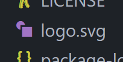

# SVG_Logo_Maker_Erin_Mulcahey

## Description

I built a Node.js command-line application that takes in user input to generate a logo. The application prompts the user to select a color and shape, provide text for the logo, and save the generated SVG to a .svg file. I made this application to make it quick an easy for a logo to be make. It give a user more time to focus on other tasks than to worry about logo creation. I learned how to create and run tests to ensure the application would function correctly. And, I learned how to create an svg file while also using the preview function to view the files.

## Installation

To use this program, the user will need to: -Clone this repository. And, open the repository from the installed folder. -Access the integrated terminal and install npm and node.js to use the repository. -type 'node index.js' into the integrated terminal. -type answers to the prompts that the programs gives the user.

## Usage

A user can use this program to help them create a logo for their own project. Using this program makes it easier for someone to quickly choose a colored shape and 3 colored characters to make a logo. They can choose the shape from a list, choose a color for the shape, choose the 3 characters to include, then also choose a color for those characters. Then, once all parts are filled out, the program will generate the logo as a SVG file based on their choices. They can then move the newly created logo file to what ever program they created it for.

Walkthrough Video: [Link to the SVG Logo Maker walk-through video](https://drive.google.com/file/d/1Ao8uft_WTRjRoYt1vpsuLgMhh8qdX8MN/view)

## Credits

N/A

## License

Please refer to the LICENSE in the repo.
